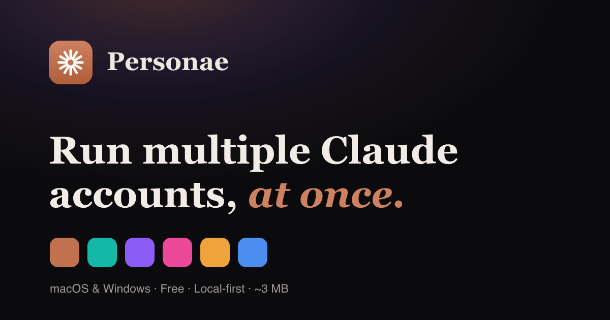

# Personae

<p align="center">
  
</p>

<p align="center">
  <a href="LICENSE"></a>
  
  <a href="https://github.com/Amorydev/MultipleClaudeProfile/actions/workflows/release.yml"></a>
  
</p>

**Run every Claude account at once — Claude Desktop *and* Claude Code (CLI) — each fully isolated.**

Claude only lets you be signed into one account at a time: the Desktop app keeps a single login (and a single-instance lock), and the Claude Code CLI holds one login at a time too. Juggling Work, Personal, and client accounts means logging out and back in all day long. Personae keeps them all signed in side by side.

It's a tiny (~3 MB) native app built with [Tauri](https://tauri.app/) (Rust backend, Vue 3 + Vite + TypeScript frontend). It doesn't repackage Claude — it *wraps* the Claude you already have installed, so it keeps working after every Claude auto-update. Everything runs locally: no account to create, no server, no telemetry.

> **Website:** https://claudemux.com
> **Not affiliated with Anthropic** — Personae is an independent companion tool for Claude.

---

## Table of contents

- [Features](#features)
- [How it works](#how-it-works)
- [Requirements](#requirements)
- [Install](#install)
- [Development](#development)
- [Build from source](#build-from-source)
- [Project structure](#project-structure)
- [Data & file locations](#data--file-locations)
- [Keyboard shortcuts](#keyboard-shortcuts)
- [Privacy & security](#privacy--security)
- [Roadmap](#roadmap)
- [Release process](#release-process)
- [Contributing](#contributing)
- [License](#license)
- [Acknowledgements](#acknowledgements)

---

## Features

### Claude Desktop profiles
- **Multiple accounts, side by side.** Each profile runs the real Claude Desktop app in its own window — no single-instance lock.
- **Fully isolated.** Every profile gets its own login, chat history, cookies, and MCP settings via a dedicated data directory. Nothing bleeds between accounts.
- **Colour-coded.** Each profile gets its own tint (11-colour palette) and a matching, tinted app icon registered with the OS, so it shows up in Spotlight/Dock as its own app and you can tell accounts apart at a glance.
- **Survives Claude updates.** Personae orchestrates the Claude Desktop you already installed rather than bundling its own copy.
- **Manage profiles:** create, launch, quit, recolour, repair, and delete (optionally purging the profile's data).

### Claude Code (CLI) logins
- **Multiple CLI logins in parallel**, each pinned to its own `CLAUDE_CONFIG_DIR`. Sign in once per profile and it stays signed in.
- **Zero app-managed secrets.** Personae never sees, injects, or stores your tokens. Claude Code namespaces each OAuth credential in your OS keychain by a hash of `CLAUDE_CONFIG_DIR`, so distinct config dirs give distinct, durable, concurrently-usable logins. No token injection, no shims, no `PATH` rewriting.
- **One-time login flow.** Creating a CLI profile opens a terminal that runs `claude` in that profile's config dir; a single `/login` seeds it.

### IDE workspaces
- **Open any CLI account inside your IDE at a specific project.** Supported IDEs: **VS Code, Cursor, Windsurf, and Antigravity**.
- Personae wires `CLAUDE_CONFIG_DIR` into the IDE's integrated terminal (via the project's `.vscode/settings.json` and a launch task) — no `PATH` hacks.
- **Save workspaces** (account + IDE + project) and reopen them in one click.

---

## How it works

Personae is a thin orchestration layer over environment variables that Claude already respects. It holds no credentials of its own.

| Surface | Isolation mechanism |
| --- | --- |
| **Claude Desktop** | Each profile launcher sets `CLAUDE_USER_DATA_DIR` (env isolation, default) or passes `--user-data-dir` (flag isolation) so Claude reads/writes a per-profile data directory. |
| **Claude Code (CLI)** | Each profile launcher sets `CLAUDE_CONFIG_DIR`. Claude Code stores the OAuth credential in the OS keychain under a service name derived from `sha256(CLAUDE_CONFIG_DIR)`, so each config dir is a separate, persistent login. |
| **IDE** | The chosen account's `CLAUDE_CONFIG_DIR` is injected into the IDE's integrated-terminal environment for the target project, so `claude` in that terminal resolves to the right account. |

Because isolation is driven entirely by these directories and env vars, Personae never repackages Claude and never handles secrets.

---

## Requirements

- **OS:** macOS 11+ or Windows 10+.
- **Claude Desktop** installed (for Desktop profiles). Personae auto-detects it at `/Applications/Claude.app` or `~/Applications/Claude.app`; set the `CLAUDE_APP` env var to point at a non-standard location.
- **Claude Code CLI** installed and on your `PATH` (for CLI profiles). See the [Claude Code docs](https://docs.claude.com/en/docs/claude-code).

> **Platform status:** macOS is the primary, tested platform. Windows support is implemented and actively being verified — see [`docs/WINDOWS-TEST-PLAN.md`](docs/WINDOWS-TEST-PLAN.md) for the current checklist.

---

## Install

Download the latest build for your platform from **https://claudemux.com**.

- macOS: universal `.dmg` (Apple Silicon + Intel)
- Windows: `.msi` / `-setup.exe`

To build it yourself instead, see [Build from source](#build-from-source).

---

## Development

Prerequisites:

- **Node.js** (LTS) — for the Vite frontend build and the Tauri CLI.
- **Rust** (stable toolchain, via [rustup](https://rustup.rs/)) — for the backend.
- Platform toolchain for Tauri — see the [Tauri v2 prerequisites](https://tauri.app/start/prerequisites/) (Xcode Command Line Tools on macOS; Microsoft C++ Build Tools + WebView2 on Windows).

Install dependencies and start the app in dev mode (Vite hot-reloads the frontend, Rust rebuilds on change):

```bash
npm install
npm run tauri dev
```

The frontend is a [Vue 3](https://vuejs.org/) + [Vite](https://vitejs.dev/) app (TypeScript, Composition API, Pinia) in [`src/`](src/). `npm run build` type-checks with `vue-tsc` and bundles with Vite; `npm run test` runs the [Vitest](https://vitest.dev/) suite.

---

## Build from source

Clone the repository:

```bash
git clone https://github.com/Amorydev/MultipleClaudeProfile.git
cd MultipleClaudeProfile
```

Then produce distributable installers for the current platform:

```bash
npm run tauri build
```

Artifacts are written to `src-tauri/target/release/bundle/` (`.dmg`/`.app` on macOS, `.msi`/`.exe` on Windows).

> **Note:** if `cargo` isn't on your `PATH`, add your rustup toolchain's `bin` directory (e.g. `~/.rustup/toolchains/stable-*/bin`) before building.

---

## Project structure

```
.
├── src/                     # Frontend — Vue 3 + Vite + TypeScript (Pinia)
│   ├── main.ts
│   ├── App.vue
│   ├── components/          # UI components (cli/, desktop/, shared)
│   ├── stores/              # Pinia stores
│   ├── composables/         # Shared composition functions
│   ├── lib/                 # Tauri IPC bridge, formatting, types
│   ├── index.html
│   └── styles.css
├── crates/engine/           # personae-engine — business logic (no Tauri dep)
│   └── src/                 # platform, macos, windows, cli, ide, terminal, browser, desktop_prefs
├── src-tauri/               # Thin Tauri v2 wrapper crate
│   └── src/lib.rs           # #[tauri::command] handlers (the app's API surface)
├── bin/personae.js          # `personae` CLI launcher (npm run deploy)
├── landing/                 # Marketing site source (claudemux.com)
├── docs/                    # Windows test plan / QA checklist
└── .github/workflows/       # CI: release build + publish
```

---

## Data & file locations

Personae stores everything under your user directory. On **macOS**:

| What | Location |
| --- | --- |
| Desktop profile launchers | `~/Applications/Claude Profiles/` |
| Desktop profile data (`CLAUDE_USER_DATA_DIR`) | `~/Library/Application Support/ClaudeProfiles/<slug>/` |
| CLI profile launchers | `~/Applications/Claude Profiles CLI/` |
| CLI profile config (`CLAUDE_CONFIG_DIR`) | `~/Library/Application Support/ClaudeProfilesCLI/<slug>/` |

On **Windows**, the equivalents live under `%APPDATA%` / `%LOCALAPPDATA%`. CLI OAuth credentials are held by the OS keychain (managed by Claude Code), never by Personae.

---

## Keyboard shortcuts

Personae is keyboard-first (`⌘` on macOS, `Ctrl` on Windows):

| Key | Action |
| --- | --- |
| `⌘/Ctrl + N` | New profile |
| `⌘/Ctrl + L` | Launch the selected profile |
| `⌘/Ctrl + R` | Repair profiles |
| `/` | Focus the search box |
| `↑` / `↓` | Move selection |
| `Enter` | Launch the selected profile (quit if running / log in if not signed in) |
| `Delete` / `Backspace` | Remove the selected profile |
| `Esc` | Close the open dialog |

---

## Privacy & security

- **Local-first:** no account, no server, no telemetry. Personae only orchestrates the Claude apps already on your machine.
- **No app-managed secrets:** for CLI profiles, credentials are handled entirely by Claude Code and your OS keychain. Personae never reads or writes your tokens.
- **Untrusted config is treated as data:** values sourced from third-party MCP/config are rendered as text, never as HTML.

---

## Roadmap

- **Per-project MCP management** — CRUD for MCP servers scoped per project/profile, mapped to Claude Code's `project` / `local` / `user` scopes. *(Designed; not yet implemented.)*
- Broader Windows verification per [`docs/WINDOWS-TEST-PLAN.md`](docs/WINDOWS-TEST-PLAN.md).

---

## Release process

Releases are cut by pushing a `v*` tag. [GitHub Actions](.github/workflows/release.yml) then builds a macOS universal binary and Windows installers and uploads them as workflow artifacts. When the optional VPS secrets are configured, it also mirrors the installers to the download host behind https://claudemux.com/dl.

```bash
git tag v0.1.0
git push origin v0.1.0
```

---

## Contributing

Contributions are welcome — bug reports, feature ideas, and pull requests are all appreciated.

- **Issues:** open one at [github.com/Amorydev/MultipleClaudeProfile/issues](https://github.com/Amorydev/MultipleClaudeProfile/issues).
- **Pull requests:** fork the repo, create a feature branch, and use the [Development](#development) setup to run the app locally. Keep changes focused and match the surrounding style — the Rust backend favours small, testable pure functions organised per module (`macos.rs`, `windows.rs`, `cli.rs`, `ide.rs`).
- **Platform-specific code:** most logic is shared, but Desktop-profile handling is OS-specific. If you touch Windows behaviour, follow [`docs/WINDOWS-TEST-PLAN.md`](docs/WINDOWS-TEST-PLAN.md).

By contributing, you agree that your contributions will be licensed under the MIT License.

---

## License

Released under the [MIT License](LICENSE) — © 2026 Amory Dev.

Personae is an independent, open-source companion tool. It is **not affiliated with, or endorsed by, Anthropic**. "Claude" and "Anthropic" are trademarks of Anthropic, PBC.

---

## Acknowledgements

- Built with [Tauri](https://tauri.app/) — tiny, secure, native apps with a Rust core.
- Designed to work alongside [Claude Desktop](https://claude.ai/download) and [Claude Code](https://docs.claude.com/en/docs/claude-code) by Anthropic.
